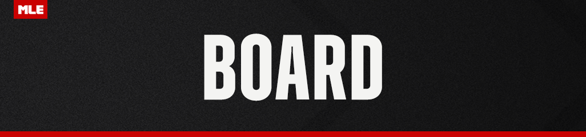
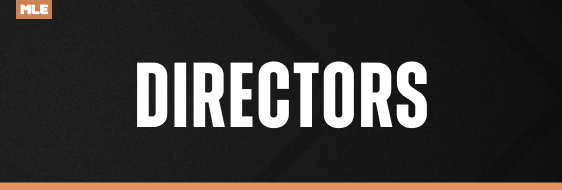
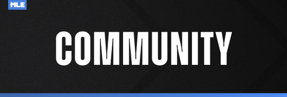
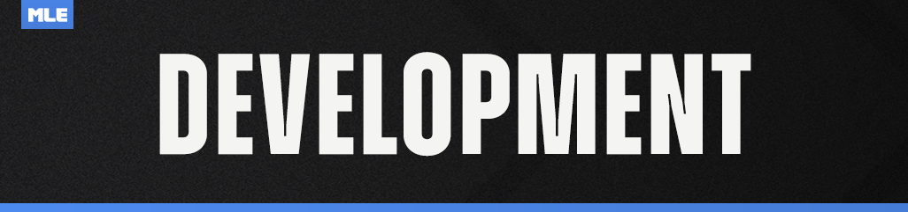
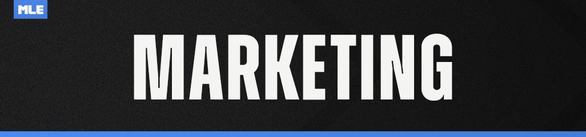
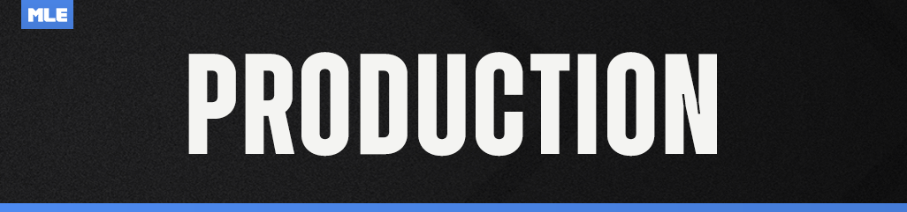
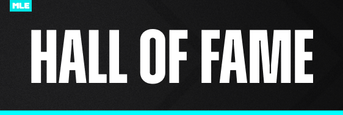

# MLE Staff Directory

This page is intended to be the single source of truth for MLE staff members. Who does what, who is in what department, etc. Maintaining staff lists in several different areas has become too much of a chore, here is everyone in one place.

## Board

The Board is responsible for all high-level planning, decision making, and the direction of Minor League Esports as a whole.

Members of the Board are in charge of inter-organizational relations, as well as overseeing the direction of Minor League Esports' various departments.
Members of the Board are in charge of final decision making, as well as guiding the driving objectives of the organization. Board members are often (but not always) department heads.

The organization as a whole is owned by TheGamingBear.

- **Owner:** TheGamingBear (@thegamingbear)
- **Admin Advisor:** TyTy (@tyty)
- **Board Members:**
    - AnOliveBranch (@anolivebranch)
    - delta (@delta727)
    - Han1ckz (@han1ckz)
    - Leachy (@leachy)
    - Nigel Thornbrake (@nigelthornbrake)
    - pandy (@flashpandy)

## Directors

Directors are responsible for high-level planning, decision making, and direction of their department within Minor League Esports.
Directors oversee specific portfolios, guiding Coordinators in running their teams.

- **Community Director:** thepiggybuggy (@thepiggybuggy)
- **Development Director:** OwnerOfTheWhiteSedan (@ownerofthewhitesedan)
- **League Operations (RL) Director:** Lack (@lackkkk)
- **League Operations (TM) Director:** Ant (@anthill)
- **Marketing Director:** SkyGuy (@xskyguy17x)
- **Production Director:** Half Past White (@halfpastwhite)

## Community

Community is primarily responsible for the moderation of Minor League Esports, upholding the values of Minor League Esports and enforcing community conduct rules. Which is upheld both in the admissions process for new members and moderation of all current members.

Community also coordinates receiving and processing community feedback, to distribute to the rest of staff as applicable, and maintains the Discord server for the upkeep and improvement of users’ experience. In addition, they plan and execute many events and activities that fall outside of the core competitive play but are meant to further the community feel in the league.

Teams under Community include Moderation, Admissions, Events, and User Experience.

### Leadership

- **Head of Community:** AnOliveBranch (@anolivebranch)
- **Community Director:** thepiggybuggy (@thepiggybuggy)
- **Community Coordinators:**
    - **Admissions (RL):** xSnipz21x (@xsnipz21x)
    - **Admissions (TM):** Yz (@yz220)
    - **Events (RL):** xenn (@xenn._.)
    - **Events (TM):** JonCornDog (@joncorndog)
    - **Moderation:** Pieman_RL (@pieman_rl)
    - **User Experience:** *Vacant*

### Admissions

#### Rocket League

- **RL Admissions Coordinator:** xSnipz21x (@xsnipz21x)
- **RL Admissions Team Lead:** ElCuchinero Cuh (@elcuchinero)
- **RL Admissions Team:**
    - Ant (@anthill)
    - Eth (@ethu_)
    - Guardsmen (@guardsmen_.)
    - HiChew (@hichew.rl)
    - jgarrett770 (@jgarrett779)
    - MapleSyrup (@maplesyrup.__.)

#### Trackmania

- **TM Admissions Coordinator:** Yz (@yz220)
- **TM Admissions Team Lead:** *Vacant*
- **TM Admissions Team:**
    - 16BitZak (@zackthewarrior)
    - Ant (@anthill)
    - malia (@rrecoil00)
    - okboomer (@okboomer0998)
    - Yukigeshiki (@yukigeshikijp)

### Events

#### Rocket League

- **RL Events Coordinator:** xenn (@xenn._.)
- **RL Events Team Lead:**
- **RL Events Team:**
    - *TBD*

#### Trackmania

- **TM Events Coordinator:** JonCornDog (@joncorndog)
- **TM Events Team Lead:**
- **TM Events Team:**
    - *TBD*

### Moderation

- **Moderation Coordinator:** Pieman_RL (@pieman_rl)
- **Moderation Team Lead:** AlyssaBee (@iamalyssabee)
- **Moderation Team:**
    - Amber (@theelastictuba)
    - Atherolite (@atherolite)
    - Connor (@c0nn0r_20)
    - Dandaman (@_dandaman)
    - Fools (@drfools)
    - Manatee (@manatee)
    - Prosperity2K (@prosperity2k)
    - Shag (@shagoliath)
    - Water (@water_rl)
    - Xenn (@xenn._.)

### User Experience

- **User Experience Coordinator:** *Vacant*
- **User Experience Team:**
    - *Vacant*

## Development

The Development Department is the technological backbone of Minor League Esports (MLE). We design, build, and maintain all software that powers the league's operations, from member-facing tools to internal administration platforms. We are committed to providing reliable, innovative solutions and outstanding
support to all MLE stakeholders.

The department plays a multifaceted role in the league's success:

Software Development: We create, deploy, and continuously improve the custom software tools that are essential for both MLE members and staff. This includes platforms for scheduling, match tracking, communication, and much more.

Website Management: We ensure that the MLE website is up-to-date, user-friendly, and represents the league's brand effectively.

Sprocket Liaison: We actively collaborate with the Sprocket team to integrate their platform seamlessly with MLE's needs and advocate for features that benefit our community.

User Support: We provide comprehensive support to all users of MLE's software and website, resolving issues quickly and gathering feedback to guide future improvements.

Data Science & Statistics: Our dedicated team of data scientists and statisticians analyzes vast amounts of league data to generate insights that drive decision-making, inform rankings, create captivating leaderboards, and provide exciting projections for playoff races and outcomes.

Our department is dedicated to leveraging technology to create the best possible experience for everyone involved in Minor League Esports. To that end, we are always open to members looking for an opportunity to develop and grow their technology skills within our ranks. To learn more, reach out to @MLE Staff Mailbox and let us know you're interested!

### Leadership

- **Head of Development:** Nigel Thornbrake (@nigelthornbrake)
- **Development Director:** OwnerOfTheWhiteSedan (@ownerofthewhitesedan)

## League Operations (RL)

League Operations is responsible for administration of Minor League Esports' competitive leagues.
This includes series scheduling, salary tracking, roster moves, rule interpretations, and anything else relevant to the MLE competitive environment.
They are also in charge of aiding franchises / players on game days, and act as the arbitrator of disputes and issues that arise related to competing in MLE.

### Leadership

- **Head of RL Operations:** delta (@delta727)
- **RL Operations Director:** Lack (@Lackkkk)
- **RL Operations Coordinators:**
    - **Communications:** Peyton (@peyton_.)
    - **Competitive Integrity:** Flump (@flumpski)
    - **Competitive Integrity:** Manatee (@manatee)
    - **NCPs:** Pas818 (@pas818)
    - **Processing:** *Vacant*
    - **Waivers:** AndyMcMuffin (@andymcmuffin)
- **RL Operations Advisors:**
    - Adi (@asapre)
    - Achilles (@_achilles__)
    - Nim (@nim.x)
    - Kend0 (@kend0slice)

### Competitive Integrity

- **Competitive Integrity Coordinator:** Flump (@flumpski)
- **Competitive Integrity Coordinator:** Manatee (@manatee)
- **Competitive Integrity Team Lead:** uwuwMLEnjoyer (@wyntahfox)
- **Competitive Integrity Team Lead:** EthsFox (@ethu_)
- **Competitive Integrity Team:**
    - Crazy (@crazylegs10)
    - MikeIsMyIke (@mikeismyike)
    - John McVegan (@johnmcvegan)
    - QubeKnight (@qubeknight)
    - Darkk (@_darkk_)
    - Rolo (@rolojohnson)

### NCPs

- **NCPs Coordinator:** Pas818 (@pas818)
- **NCPs Team Lead:** *Vacant*
- **NCPs Team:**
    - Hermod (@.hermod.)
    - Kurrazo (@kurrazo)
    - Yz (@yz220)

### Processing

- **Processing Coordinator:** *Vacant*
- **Processing Team Lead:** *Vacant*
- **Processing Team:**
    - Half Past White (@halfpastwhite)
    - Lack (@lackkkk)
    - BattleBennyB (@battlebennyb)
    - T E X (@texascyclone)
    - BigQ (@biggq)
    - Aydxn (@aydxn_0907)

### Waivers

- **Waivers Coordinator:** AndyMcMuffin (@andymcmuffin)
- **Waivers Team Lead:** Onyx (@onyx076)
- **Waivers Team:**
    - Rikr (@rvx.rikr_)
    - Moose (@itzmooserl)

## League Operations (TM)

League Operations is responsible for administration of Minor League Esports' competitive leagues.
This includes series scheduling, salary tracking, roster moves, rule interpretations, and anything else relevant to the MLE competitive environment.
They are also in charge of aiding franchises / players on game days, and act as the arbitrator of disputes and issues that arise related to competing in MLE.

For opportunities to get involved with TM League Operations, head to the Trackmania server!

### Leadership

- **Head of TM Operations:** Leachy (@leachy)
- **TM Operations Director:** Ant (@anthill)
- **TM Operations Coordinators:**
    - **League Operations:** okboomer (@okboomer0998)
    - **Competitive Integrity:** uwuMLEnjoyer (@wyntahfox)
    - **NCPs:** *Vacant*
    - **Processing:** *Vacant*
    - **Waivers:** *Vacant*
- **TM Operations Advisors:** 
    - Zyta (@zytabyte)

### Competitive Integrity

- **Competitive Integrity Coordinator:** uwuMLEnjoyer (@wyntahfox)
- **Competitive Integrity Team Lead:** 16BitZak (@16bitzak)
- **Competitive Integrity Team:**
    - NLBS (@nlbs) 
    - Darkk (@darkk)

### NCPs

- **NCPs Coordinator:** *Vacant*
- **NCPs Team Lead:** *Vacant*
- **NCPs Team:**
    - *TBD*

### Processing

- **Processing Coordinator:** *Vacant*
- **Processing Team Lead:** *Vacant*
- **Processing Team:**
    - ElCuchinero Cuh (@elcuchinero)

### Waivers

- **Waivers Coordinator:** *Vacant*
- **Waivers Team Lead:** *Vacant*
- **Waivers Team:**
    - *TBD*

## Marketing

Marketing is responsible for external communications, including advertising, social media, and website content and development, as well as official league merchandising. Marketing also oversees the sponsorship team who builds relationships with companies and external organizations, with the goal of securing sponsors for giveaways and financial donations to the league.

For open opportunities to get involved with the Marketing, see ⁠marketing-forms.

### Leadership

- **Head of Marketing:** han1ckz (@han1ckz)
- **Marketing Director:** xskyguy17x (@xskyguy17x)
- **Marketing Advisors:**
    - raspberries (@raspberries)
    - rolojohnson (@rolojohnson)
- **Marketing Coordinator:** crazylegs10 (@crazylegs10)
- **Marketing Team Lead:** iamalyssabee (@iamalyssabee)
- **Esports Communications Coordinators:**
    - kkube (@kkube)
    - xsnipz21x (@xsnipz21x)
- **Media Marketing Coordinator:** flappecino (@flappecino)

### Social Media
- **Social Media Team Lead:** flappecino (@flappecino)
- **Social Media Team:**
    - starb0yd (@starb0yd) — Caption Writer
    - thedarkhero77 (@thedarkhero77) — Caption Writer
    - bgriiff (@bgriiff) — Trend Watcher
    - xsnipz21x (@xsnipz21x) — TikTok

### Video Editing
- **Video Editing Team:**
    - zracii (@zracii) — Editor
    - erehereh (@erehereh) — Editor

### Sponsorship
- **Sponsorship Team Lead:** *Vacant*
- **Sponsorship Team:**
    - pander_rl (@pander_rl) — Sponsorship Agent
    - Coley (@coley) — Pitch Deck Assistant
    - yz220 (@yz220) — Sponsor Researcher

### Merchandising
- **Merch Team Lead:** tunloink (@tunloink)
- **Merch Team:**
    - leighanicole_ (@leighanicole_) — Mockup Designer
    - *Vacant* — Mockup Designer
    - *Vacant* — Store Assistant

### Web & Digital
- **Website Dev Coordinator:** mallowsc (@mallowsc) *(Development Dept)*
- **Website Content Team Lead:** *Vacant*
- **Web Content Team:**
    - *Vacant* — Content Contributor

## Production

Production is responsible for the creation and management of all Minor League Esports media content, as well as the live broadcasting of matches and events within MLE, a feat which requires many different sub-teams.
This includes the Twitch streams, overlays, video edits, and all graphic design needs of the organization. As well as a host of dedicated casters, broadcasters, and match officials, who ensure the stream is professional and runs smoothly.
Production also is responsible for our Open Net streams, as well as power rankings, which are released during Open Net.

For open opportunities to get involved with Production, see ⁠production-forms.

### Leadership

- **Head of Production:** pandy (@flashpandy)
- **Production Director:** Half Past White (@halfpastwhite)

## Hall of Fame

The MLE Hall of Fame recognizes individuals whose lasting contributions and exemplary presence have shaped the culture and success of Minor League Esports. Inductees are distinguished not solely by tenure or title, but by the strength of their character, leadership, and the enduring respect they've earned throughout the community. 

Legacy members of the Hall of Fame were inducted prior to the revival of the Hall in July 2025. The MLE Hall of Fame now operates by inducting a few new members per season, except for the initial larger Season 18 class.

### Legacy

- Azulite
- Hanz0_hattori
- Hunter
- InanimateJ
- MbizzleBruh
- Rick
- TastyChick3n

### Season 18

- Adi
- Blackwatch
- Deejay
- furphy
- Kend0.
- Kunics
- Mateo
- MikeIsMyIke
- Phi Sig
- R E D
- Reverse Fridge
- Riz
- rolo
- Stovvadz
- Taelo
- Water
- Wray
- Zyta

## Making Updates

With the move to Knowledge Base, the process of staff leaders making updates to the directory has changed. Directory updates no longer need to flow through an intermediary spreadsheet and be reviewed and executed by the user experience team (or in practice, specifically Olive). Follow the [how to contribute](index#how-to-contribute) instructions for updating knowledge base. This allows anyone to make direct updates to the directory (with a peer review/approval by staff before it goes live of course).